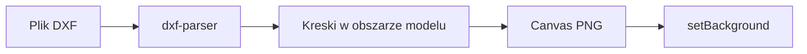

# Import podkładu DXF

DXF nie staje się rysunkiem wektorowym w edytorze. Tak jak PDF w [`src/services/background.ts`](src/services/background.ts), plik jest rysowany na canvas i zapisywany jako PNG (`mimeType: "image/png"`). Symbole i trasy zostają na wierzchu. Pole `kind` dostaje wartość `"dxf"`, żeby w projekcie było widać źródło; bajty w `.epaint` to nadal PNG, więc [`SCHEMA_VERSION`](src/domain/types.ts) zostaje `1`.

## Parser

Zależność `dxf-parser` (MIT, działa w przeglądarce i w Tauri, offline). Tylko DXF tekstowy. Plik binarny (nagłówek `AutoCAD Binary DXF`) kończy się komunikatem, żeby zapisać DXF jako ASCII.

## Co jest rysowane

Z sekcji ENTITIES bierzemy obszar modelu (`inPaperSpace` puste). Gdy jest pusty, bierzemy przestrzeń papieru.

- `LINE`, `LWPOLYLINE`, `POLYLINE` (zamknięcie flagą shape)
- łuk z bulge na polilinii (próbkowanie łuku, typowy łuk drzwi)
- `CIRCLE`, `ARC`
- `INSERT`: rozwinięcie bloku ze skalą, obrotem i pozycją, z limitem zagnieżdżenia i ochroną przed pętlą

Pomijane: tekst, wymiary, kreskowanie, splajny, elipsy, bryły. Warstwy wyłączone lub zamrożone nie wchodzą na rysunek, o ile parser poda te flagi.

Tło białe, kreski ciemne (`#1a1a1a`). Kolory CAD (żółty, biały ACI 7) na białym tle giną, a podkład ma być czytelny pod symbolami. Oś Y DXF jest w górę, canvas w dół — odbicie przy rysowaniu.

Ramka: bounding box kresek, margines, dłuższy bok około 3200 px, grubość linii 1 px. Pusty rysunek to błąd po polsku, bez cichego pustego płótna.

## Wejście w aplikację

W [`src/services/documentActions.ts`](src/services/documentActions.ts) gałąź obok PDF: rozszerzenie `.dxf` woła rasteryzację i `setBackground` z `kind: "dxf"`. Reszta importu JPG/PNG/WebP/PDF bez zmian.

W [`src/app/App.tsx`](src/app/App.tsx) dopisać `.dxf` do `accept` inputu importu. Błąd parsowania pokazać w istniejącym banerze (dziś `onImportFile` nie łapie wyjątków). Bez modala wyboru strony — DXF nie ma stron jak PDF.

Typy `Background.kind` i `LoadedBackground.kind`: `"image" | "pdf" | "dxf"`.

## Test

Czysta funkcja zbierania kresek (bez canvas; jsdom nie ma 2D) w teście Vitest na krótkim DXF w pamięci: linia, zamknięta polilinia, okrąg, `INSERT` bloku z linią. Osobny przypadek: binarny nagłówek rzuca błąd. Raster canvas zostaje cienką warstwą nad tą funkcją, tak jak `rasterizePdfPage`.

Po implementacji wczytać przykładowy ASCII DXF w przeglądarce i sprawdzić, że tło wypełnia widok, a JPG/PDF nadal wchodzą tym samym przyciskiem.
